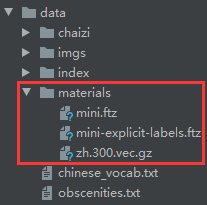

# 安全AI挑战者计划 - 文本分类对抗攻击 - 解决方案

​	[此repo](https://github.com/sfzhou5678/TextualAdversarialAttack-Tianchi)是我在[安全AI挑战者计划第三期 - 文本分类对抗攻击](https://tianchi.aliyun.com/competition/entrance/231762/introduction)比赛中的参赛代码，线上得分312.76, 线上排名12/1175。

​	本次比赛的任务为中文场景下的**辱骂场景对抗攻击**：基于辱骂文本生成对抗样本，使模型识别错误，同时扰动较小，并且不影响辱骂性质。举例来说,本方案可实现如下形式的转换：

> - **原始文本:** "真他妈搞笑 还浏览啥网站 哦那可不可以告你们侵犯人家隐私 是付不起你妈的丧葬费了？"
>
> - **对抗文本:** "真t蚂搞笑还浏览啥网站哦那可以不可以告坭们侵犯人家隐私是付布起Nl玛得丧葬费了？"
>
>   
>
> - **原始本文2:** "你爹我用核弹轰击你妈子宫并产⽣巨大能量为城市发电"
>
> - **对抗文本2**: "倪8Wow用核弹轰击鉨mj宫并产巨大能量为城市发电"

​	针对上述任务，本方案提出了多种**通用的中文文本替换手段**并结合**启发式搜索**实现黑盒文本对抗攻击。此方案所涉及的人工规则极少，因此只需提供相应的本地防御模型，本文攻击方法可快速迁移至其他文本对抗攻击领域。


## 任务难点

#### 1. 线上数据与模型不可见

​	比赛主办方不提供任何文本数据进行离线的测试，所以需要自己收集相关数据。而且比赛中需要攻击的1000条文本不公开，我们无从得知文本特征，也无法通过观察攻击的结果来进行优化。同时，线上部署的防御模型集成了多种防御机制，且具体方案选手不可见，因此基于白盒的攻击手段基本失效，而采用黑盒攻击也较难做出针对性攻击。

#### 2. CPU限定，且攻击限时

​	比赛要求在CPU环境下，在30分钟内完成对1000条文本的攻击，因此对模型的攻击速度有一定的要求。

#### 3. 中文文本对抗攻击和英文文本攻击存在较大差别

​	目前主流的文本对抗攻击的研究集中在英文语料上，所采取的的攻击手段大多是对一个word中的某些char进行错别字替换、删除、调换顺序，而这些攻击手段难以直接迁移到中文的字符处理上。


## 本地测评数据集构建

​	本方案收集了2000W微博评论语料和[骂人宝典](https://nmsl.shadiao.app/?from_shadiao)中的脏话语料，然后以脏话语料为基础迭代式地训练和构建本地测评数据集：用脏话预料+随机负采样的方式训练bert模型，然后遍历微博语料输出候选脏话数据，通过人工辨别确定新的脏话数据，并进行下一轮迭代。

​	最终产生的脏话语料[data/obscenities.txt](data/obscenities.txt)包含1817条辱骂文本。


## 整体方案

​	本repo的整体方案为**启发式搜索**：对于给定原始文本，首先将其作为种子文本开始迭代式攻击。每轮攻击选择种子文本的一个或多个目标tokens，然后使用多种攻击手段进行变换，从而产生多个新的候选种子文本，接着再使用本地的防御模型(官方提供的mini fasttext模型)对候选种子文本进行评分，并挑选出下一轮迭代的种子，如此重复迭代多轮。

​	另外考虑到线上模型部署了新词挖掘机制来防御新出现的黑词，本方案还设计了**抗"挖掘防御机制"机制**进行对抗。	

​	整体流程位于[attackers.py](attackers.py)文件中。

### 1. 目标token选择

​	对于分词过后的tokens序列，本方案需要在每轮迭代中选择一个或多个token进行替换攻击。

**1) 基于本地防御模型的token选择**

​	在起始攻击时可采用本地防御模型进行关键词识别。基本思想是遍历式drop掉分词过后的tokens序列中的每个token，根据drop前后模型分类的概率差值作为该token的影响力大小。然后以影响力大小作为选择该token进行替换的概率。

**2) 抗"挖掘防御机制"机制 - 关键词识别**

​	**待攻击的1000条文本本身均为辱骂文本，这些文本所包含的token是辱骂关键词的概率较大，且这些tokens大概率会被线上的防御模型作为特征捕捉。**因此可以统计每个原始文本中的token的出现频次，然后将每个token的历史词频大小转换成选择该token的概率。通过这种方法可以在无人工干预的前提下实现辱骂关键词的自动识别，并在后续操作中替换掉这些关键词。另外，本方案产生的对抗文本中的新引入的黑话tokens若频次过高，则会被线上的挖掘防御机制挖掘并处理，因此本方案会在原始文本的tokens以外，额外记录输出的对抗文本中的各token的词频。

​	在统计到一定量的词频之后，目标token的选择方法会从基于本地防御模型的方法切换至上述抗"挖掘防御机制"的关键词识别方法。

### 2. 关键词替换

​	本方案所有替换手段集中在[manipulate](manipulate)目录下。给定的tokens序列以及需要进行替换的token，可通过以下方法产生攻击本文。


**表1. 关键词替换手段汇总表**

|      类名      |                      基本思想                       |      示例       |                             备注                             |
| :------------: | :-------------------------------------------------: | :-------------: | :----------------------------------------------------------: |
|    Phonetic    |       将中文字符转换成对应的拼音或拼音首字母        |      你→ni      |                                                              |
|   HuoXingWen   |                  中文字符火星文化                   |      你→伱      |                                                              |
|    Radical     |                      偏旁拆分                       |     妈→女马     |             会出现一些意外的拆分，比如死→一夕匕              |
| Pronunciation  |           将中文字符替换成相同发音的字符            |      你→泥      |                                                              |
|  SameRadical   |         将中文字符替换成有相同右偏旁的字符          |      妈→犸      |                                                              |
|   Embedding    |             找到向量相似的词汇进行替换              |                 | 处于metrics的考量，本次比赛应使用欧氏距离而不是余弦距离衡量相似度 |
|     Shape      |               英文、数字的同形状替换                | il1、0O互相替换 | 还有更多的比如kκ、vν、yγ等替换本次比赛不可用，但是其他场景下可用 |
|   Homonymic    |  广义谐音替换，包括中、英、数字的多种组合+中文口音  | 小→ xla0,这-→介 |                 需要一定的观察来制定变换规则                 |
|   TokenSwap    |         将目标token与其邻近的token进行替换          |                 |                                                              |
|    CharSwap    |  针对非英文、数字的token，将首尾以外的字符随机乱序  |   fuck → fcuk   |                                                              |
|      Add       |                    随机插入噪声                     |                 |                                                              |
|   SepInsert    |      在一个英文、数字的token内部插入随机分隔符      |   xiao→xi_ao    |                                                              |
|    Brackets    |               在指定token两侧加上括号               |     你→(你)     |                                                              |
| RandomReplace  |           将指定的token随机替换成一个噪声           |                 |                                                              |
|      Drop      |                    丢弃指定token                    |                 |                                                              |
| SegmentShuffle |              在临近范围内重新排列字符               |                 |                研表究明，汉字的序顺不影阅响读                |
|   Sequential   | 一个工具类，可以组合多个变换手段对指定token依次变换 |  小→xiao→xla0   |                                                              |


### 3. 迭代攻击

**1) 基本迭代**

​	如上所述，本repo的整体方案为**启发式搜索**，将给定的原始文本作为起点，每轮迭代随机选择其中一个或多个token进行替换从而产生候选样本，然后通过本地的防御模型进行评分，选出下一轮的K个种子文本，如此反复迭代R轮。通常来说增大R和K的取值可以带来更好的结果，但是也会增加攻击耗时。本文方案R=30，K=10。

**2) 短文本优化**

​	调研发现，在本地测评数据上，随着迭代轮数的增多，短文本的分数增长幅度要大于长文本的。入下图所示，长度为10的本文迭代40轮的得分相较20轮的约有0.02的提升，而对于长度为55的文本来说，该提升仅约0.002，收益远小于短文本。所以本文方案在处理短文本时会自动根据本文长度增大迭代轮数。


**3) 抗"挖掘防御机制"机制 - 热词降权**

​	考虑到线上部署的防御机制，在每轮迭代选择种子样本时，我们不仅需要考虑本地防御模型的测评得分，还需要考虑样本中tokens的多样性，避免过于频繁地使用少数几个tokens导致被防御机制识别并处理。本方案对于每轮迭代中产生的候选样本，在统计样本总词频之后使用最大最小归一的方法得到一个基于历史词频的词频系数，并加权到最终的模型的分上，关键代码如下：

```python
freqs = np.array([sum([self.local_kw_freq_dict[token] if token in self.local_kw_freq_dict else 1 for token in tokens]) for tokens in cur_transformed_tokens])
freq_weights = (freqs - freqs.min()) / (freqs.max() - freqs.min())
freq_weights = 1.0 - 0.2 * freq_weights
soft_scores *= freq_weights
```


## 使用方法

1. 下载防御模型和embeddings，置于[data](data)目录(下载链接: https://pan.baidu.com/s/1gND7VQdRLpdaqM_kMxVhXg 提取码：qd8g)，如下图所示。



2. ```shell
   pip install --no-cache-dir -r requirements.txt
   ```

3. 运行[main.py](main.py)，对[data/obscenities.txt](data/obscenities.txt)中包含的原始辱骂文本进行攻击。

4. 在根目录的[adversarial.txt](adversarial.txt)内查看输出结果。

